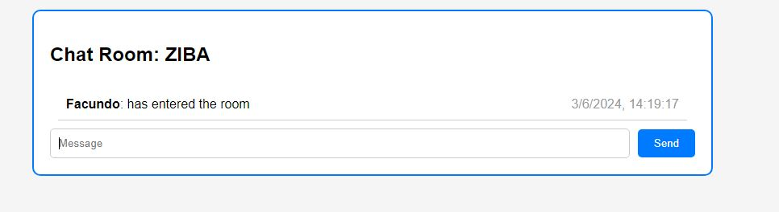
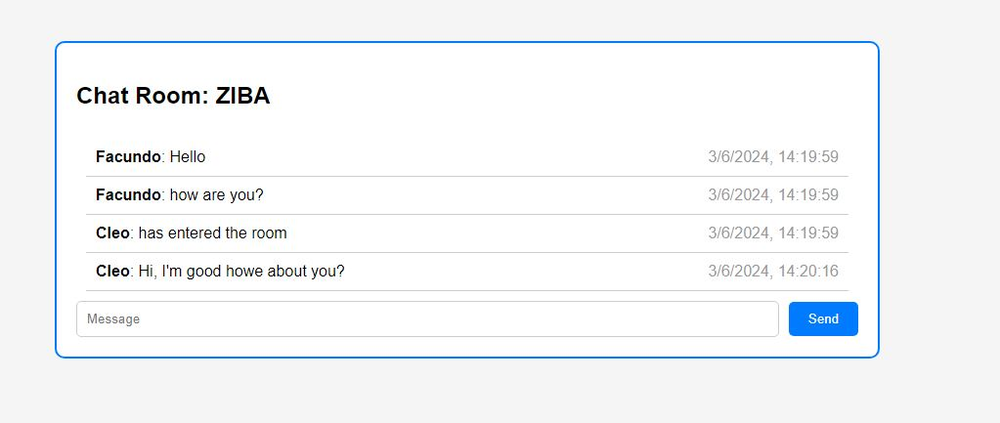

# Live chat web app
In this project I built a basic chat room web application using Flask for handling HTTP requests and SocketIO to handle the server-client commuminaction.

The app allows users to:

- Pick a username and create a new room with an unique code that they can share.
- Join an existing room with the room code.
- Chat with other users in the same room.

  The app stores all room information including the messages history in a dict, each room has a list of messages and count of active members.

  # Screenshots:

  
